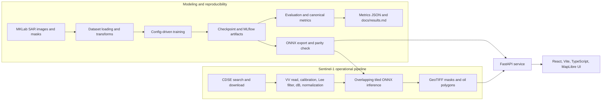

# Oil Spill Detection Project Overview

## Scope and reading note

This overview was created from the contents of the `Oil_spill` workspace, primarily the `oil-spill-detection` repository and all Markdown files present inside it. Instructions found inside repository documentation were treated as project documentation: they were analyzed and summarized, not treated as instructions that override the user's request.

The repository is a modernization of a 2024 graduation project. The current implementation, documentation, tests, and committed evaluation outputs describe the modern system; the older Streamlit/TensorFlow material is preserved as historical content only.

The workspace-level layout is:

```text
Oil_spill/
├── project_overview.md          # this generated overview
└── oil-spill-detection/         # the actual project repository
```

The `.git` directory is version-control metadata and is not described file-by-file. Ignored runtime material such as downloaded datasets, model checkpoints, `artifacts/`, `mlruns/`, frontend build output, and dependency installations is described where relevant but is not included in the committed project snapshot.

## 1. Executive summary

`oil-spill-detection` is an end-to-end semantic-segmentation system for finding marine oil spills in Sentinel-1 C-band Synthetic Aperture Radar (SAR) imagery. It addresses two different operating modes:

1. **Training/evaluation mode:** train segmentation models on a labeled five-class SAR dataset, evaluate them with oil-focused metrics, and export the selected model to ONNX.
2. **Operational detection mode:** ingest a Sentinel-1 GRD scene from the Copernicus Data Space Ecosystem (CDSE), preprocess the VV channel, run tiled ONNX inference, and emit georeferenced oil polygons and raster masks.

The five classes are:

| ID | Class | Current canonical RGB color |
| ---: | --- | --- |
| 0 | Sea Surface | `(0, 0, 0)` |
| 1 | Oil Spill | `(0, 255, 255)` |
| 2 | Look-alike | `(255, 0, 0)` |
| 3 | Ship | `(153, 76, 0)` |
| 4 | Land | `(0, 153, 0)` |

The project deliberately selects models using **Oil Spill IoU** and **Oil Spill recall**, not overall pixel accuracy. This matters because sea surface dominates the pixels and dark look-alikes such as low-wind zones, biogenic films, and rain cells can resemble oil in a single SAR channel.

The selected model is **SegFormer with the MiT-b2 encoder**. On the official 110-image test split it reports:

| Metric | SegFormer MiT-b2 |
| --- | ---: |
| Oil IoU | 0.5662 |
| Oil recall | 0.7644 |
| Mean IoU | 0.6964 |
| Macro F1 | 0.8017 |
| Pixel accuracy | 0.9668 |

The best model is exported to ONNX so the offline scene pipeline, FastAPI service, and frontend use the same inference artifact. The application can run without a model, but `/predict` remains unavailable with a clear HTTP 503 until an ONNX model is provided.

## 2. System architecture



### 2.1 Modeling path

- `oilspill.data` loads the official dataset and creates deterministic train/validation/test views.
- `oilspill.models.registry.build_model` is the single model-construction entry point. It prevents training and evaluation from accidentally using different architectures.
- The training engine uses typed YAML configuration, imbalance-aware losses, deterministic seeds, early stopping on validation oil IoU, checkpointing, and optional MLflow logging.
- The evaluation harness accumulates one multiclass confusion matrix and derives all per-class and aggregate metrics from it.
- Evaluation writes a metrics JSON, plots, a prediction gallery, and an automatically updated row in `docs/results.md`.
- The selected checkpoint is exported to ONNX and compared against the PyTorch model for numerical parity.

### 2.2 Operational path

1. Search CDSE for Sentinel-1 GRD products intersecting an AOI and date range.
2. Download the selected product archive with bearer authentication and resume support.
3. Read VV backscatter, preferably calibrate it to sigma-nought, apply a Lee speckle filter, convert to dB, and map it to the model input range.
4. Optionally rasterize Natural Earth coastlines to suppress over-land oil detections.
5. Run ONNX inference on overlapping tiles. Tile logits are blended with a cosine window before softmax/argmax, reducing seams at tile boundaries.
6. Write a class-index GeoTIFF, a colorized GeoTIFF, and an EPSG:4326 GeoJSON containing cleaned oil polygons, area, and confidence statistics.
7. Serve results through FastAPI and display them in the React UI.

## 3. Data and label model

### 3.1 Primary segmentation dataset

The primary dataset is the MKLab/m4d Oil Spill Detection Dataset. It is not committed to Git because of its size. The repository expects archives under `data/raw/` and extracts the segmentation dataset to:

```text
data/datasets/oil_spill/
├── README.txt
├── train/
│   ├── images/       # 1250x650 JPG SAR images
│   ├── labels/       # RGB masks
│   └── labels_1D/    # integer masks with values 0..4
└── test/
    ├── images/
    ├── labels/
    └── labels_1D/
```

The loader reads the JPG images and `labels_1D` masks. The single SAR channel is stored as three replicated channels so ImageNet-pretrained encoders can retain their expected three-channel input stem.

The official split is 1,002 training images and 110 test images. The code keeps the official test set untouched and deterministically carves validation from the official training set. The generated report currently contains:

| Split | Images |
| --- | ---: |
| Train | 852 |
| Validation | 150 |
| Test | 110 |
| Total | 1,112 |

The dataset helper's default validation seed is `1337`, while the checked-in training YAML files explicitly set `split_seed: 42`; the YAML configuration therefore controls actual training runs.

### 3.2 Class imbalance

On the generated training split, the pixel distribution is:

| Class | Train pixels | Share | Images containing class | Majority-to-class ratio |
| --- | ---: | ---: | ---: | ---: |
| Sea Surface | 607,751,260 | 87.794% | 846/852 | 1.0 |
| Oil Spill | 6,827,973 | 0.986% | 676/852 | 89.0 |
| Look-alike | 39,669,977 | 5.731% | 369/852 | 15.3 |
| Ship | 286,156 | 0.041% | 288/852 | 2,123.8 |
| Land | 37,714,634 | 5.448% | 208/852 | 16.1 |

This imbalance motivates class-weighted cross-entropy, Dice/Focal losses, and oil-specific model selection. A model can score well on pixel accuracy while missing most oil pixels, so accuracy is shown only as secondary context.

### 3.3 Auxiliary classification archive

`data/raw/oil_spill_classification_dataset.zip` is documented but intentionally not used. The data report explains that it is the same imagery reorganized into binary `Images_Oil` and `Images_No_Oil` folders, with matching train/test counts and filename stems. It adds no independent evaluation signal, and using it for pretraining could create leakage risks. The existing five-class masks are more informative for both oil detection and look-alike separation.

### 3.4 Checksums and committed samples

`data/checksums.sha256` records SHA-256 values for the two expected archives:

- `oil_spill_dataset.zip`: `58d607ae3ebea4173b3ff7e2d92fffac1d3f9c29a775461387a28f5cb02e60bf`
- `oil_spill_classification_dataset.zip`: `3cc4924b0ccc810895762c1e7e0f05add34b8e2447aa6671502b410eaf6c7362`

`data/samples/` contains five committed demo images (`sample_01.jpg`, `sample_02.jpg`, `sample_03.png`, `sample_04.png`, and `sample_05.jpg`). They are used by the web UI and lightweight API/UI tests.

## 4. Preprocessing and augmentation

### 4.1 Training transforms

`oilspill.data.transforms` uses SAR-aware preprocessing:

- horizontal and vertical flips;
- random 90-degree rotation;
- random resized crop;
- multiplicative speckle noise, modeled as a non-negative random gain centered at 1;
- ImageNet normalization after converting the replicated RGB values to `[0, 1]`.

Photometric color jitter, hue/saturation changes, channel shuffling, and additive optical-style Gaussian noise are deliberately excluded because the three channels represent one SAR signal, not independent optical colors. Masks use nearest-neighbor interpolation and remain integer class IDs.

Evaluation transforms are deterministic resize plus normalization only.

### 4.2 Raw Sentinel-1 preprocessing

`oilspill.pipeline.preprocess` separates the raw-scene radiometric chain into testable functions:

- `calibrate_safe`: attempts radiometric calibration to linear sigma-nought using `xarray-sentinel`.
- `read_grd_measurement`: fallback reader that converts digital-number amplitude to relative intensity when full calibration fails.
- `lee_filter`: adaptive multiplicative-speckle reduction.
- `to_db`: converts positive linear intensity to `10*log10`.
- `normalize_for_model`: linearly maps a dB window into `[0,1]`, clipping at the window edges.
- `model_ready_chw`: applies the same ImageNet normalization used by training and returns a contiguous `(3,H,W)` array.
- `land_mask_from_coastlines`: rasterizes Natural Earth land geometry onto the scene grid.

The default inference dB window is `(-25, 0)`. The documentation is explicit that this is a best-effort bridge between raw/calibrated Sentinel-1 data and the training set's undocumented 8-bit JPEG mapping; it is a major domain-gap control point.

## 5. Models and training

### 5.1 Model registry

`oilspill.models.registry` exposes a single `build_model` function. It first loads custom registrations and then resolves the configured architecture in this order:

1. a registered custom architecture;
2. a `segmentation_models_pytorch` architecture such as `Unet` or `DeepLabV3Plus`.

All builders accept a `(N, in_channels, H, W)` float tensor and return `(N, num_classes, H, W)` logits. Training may load base/pretrained weights; evaluation reconstructs the architecture without downloading base weights and then loads the trained checkpoint.

### 5.2 Implemented architectures

| Configuration name | Implementation | Main characteristics |
| --- | --- | --- |
| `Unet` | `segmentation_models_pytorch` | ResNet-34 baseline, ImageNet encoder in the full run. |
| `DeepLabV3Plus` | `segmentation_models_pytorch` fallback | ResNet-50 plus atrous spatial pyramid pooling and encoder-decoder head. |
| `segformer` | `models/segformer.py` | Hugging Face SegFormer with MiT backbone; output logits are upsampled to input resolution. |
| `foundation` | `models/foundation.py` | DINOv2-style EO foundation ViT backbone with a convolutional decode head. |

`models/second_arch.py` documents why DeepLabV3+ was chosen as the contrasting CNN architecture instead of Mask2Former. Mask2Former would require a different mask-classification/set-prediction training path, while this repository is built around shared per-pixel logits and losses.

### 5.3 Losses and class weighting

`oilspill.training.losses` supports:

- weighted multiclass cross-entropy;
- multiclass Dice;
- multiclass Focal;
- combined Dice + Focal.

`class_weights: auto` computes inverse-frequency weights from the training masks. In the combined loss, weights apply to the cross-entropy/Focal component while Dice supplies region-overlap pressure. The full runs generally use Dice + Focal with focal gamma `2.0` and `[0.5, 0.5]` Dice/Focal mixing.

### 5.4 Training engine

`oilspill.training.trainer` is a small custom PyTorch training loop rather than a PyTorch Lightning dependency. It supports:

- automatic or explicit CPU/GPU device selection;
- AMP where configured;
- AdamW optimizer;
- cosine or step scheduling;
- deterministic seeds and backend settings;
- early stopping;
- best and last checkpoints;
- MLflow parameters and per-epoch metrics;
- a small number of sample prediction panels;
- smoke-mode dataset/epoch reduction.

`training.config` defines Pydantic models for model, data, optimizer, loss, runtime, early stopping, checkpoint, and MLflow settings. YAML is validated before training and can be flattened into dotted parameters for MLflow.

### 5.5 Full configurations

- `configs/unet.yaml`: ResNet-34 U-Net, 256-pixel inputs, batch 8, 50 epochs, ImageNet weights, Dice/Focal, cosine schedule, oil-IoU early stopping.
- `configs/deeplabv3plus.yaml`: ResNet-50 DeepLabV3+, 256-pixel inputs, same general 50-epoch full-run structure.
- `configs/segformer.yaml`: MiT-b2 SegFormer, 512-pixel inputs, batch 8, lower fine-tuning learning rate `6e-5`, bf16, Hugging Face model `nvidia/mit-b2`.
- `configs/foundation.yaml`: DINOv2 base backbone, 448-pixel inputs (a multiple of patch size 14), batch 4, end-to-end fine-tuning.

The `_smoke.yaml` variants use CPU, tiny batches, no AMP, two epochs, no pretrained downloads where possible, and are intended only to prove that the training/evaluation path works. Their metrics are not representative of model quality.

### 5.6 Loss ablations

The eight files under `configs/ablations/` are generated configurations for four architectures (`Unet`, `DeepLabV3Plus`, `segformer`, `foundation`) crossed with two losses (`ce_weighted`, `dice_focal`). Each uses seed 42, a common 40-epoch budget, the architecture's base settings, and oil IoU/recall as the headline metrics. `scripts/run_ablations.py` owns the matrix and can regenerate the files; the files themselves are not intended to be edited manually.

The documented ablation budget is approximately `$0.30–$0.60` per Modal L4 run, or `$2.40–$4.80` for all eight cells. The runner can cap cells, restrict architectures, or reduce epochs to stay within a compute budget.

## 6. Evaluation and metric policy

### 6.1 Canonical implementation

`src/oilspill/metrics.py` is the single metric implementation used by training, evaluation, API model listings, and documentation. It accumulates a multiclass confusion matrix with rows as truth and columns as prediction, then derives:

- per-class IoU, precision, recall, and F1;
- mean IoU;
- macro precision, recall, and F1;
- pixel accuracy;
- oil-class IoU and oil-class recall.

For class `i`, the code uses `TP = C[i,i]`, `FP = column_sum(i) - TP`, and `FN = row_sum(i) - TP`, followed by `IoU = TP/(TP+FP+FN)`, `precision = TP/(TP+FP)`, `recall = TP/(TP+FN)`, and `F1 = 2TP/(2TP+FP+FN)`. Macro values are `nanmean` values over the defined classes.

Undefined classes are represented as `nan` internally and `null` in JSON, then excluded from macro means. This prevents absent classes from being silently interpreted as either perfect or failed predictions.

### 6.2 Why oil metrics are primary

The historical 2024 report included numbers such as accuracy, precision, and recall that were often identical, indicating likely micro-averaging across all pixels. With sea surface dominating the image, those figures can be high even if a model predicts almost no oil. The current project therefore ranks models by oil IoU and oil recall, while retaining per-class tables for transparency.

### 6.3 Committed results

`docs/results.md` is generated by the evaluation harness. It contains a summary row and per-class tables for every committed metrics JSON. Current full-test runs are:

| Run | Oil IoU | Oil recall | Mean IoU | Macro F1 | Pixel accuracy | Images |
| --- | ---: | ---: | ---: | ---: | ---: | ---: |
| `segformer-mit-b2` | 0.5662 | 0.7644 | 0.6964 | 0.8017 | 0.9668 | 110 |
| `unet-r34-baseline` | 0.5419 | 0.6853 | 0.6353 | 0.7467 | 0.9533 | 110 |
| `deeplabv3plus-r50` | 0.4806 | 0.6512 | 0.5811 | 0.6951 | 0.9292 | 110 |
| `run-20260613-101720` (`smoke`) | 0.0014 | 0.0014 | 0.2731 | 0.3470 | 0.8609 | 30 |

The selected SegFormer run's per-class values are:

| Class | IoU | Precision | Recall | F1 |
| --- | ---: | ---: | ---: | ---: |
| Sea Surface | 0.9657 | 0.9821 | 0.9830 | 0.9825 |
| Oil Spill | 0.5662 | 0.6859 | 0.7644 | 0.7231 |
| Look-alike | 0.5814 | 0.7606 | 0.7116 | 0.7353 |
| Ship | 0.4246 | 0.5393 | 0.6664 | 0.5961 |
| Land | 0.9442 | 0.9529 | 0.9903 | 0.9713 |

The smoke run is included for traceability but is explicitly excluded from the public API model list.

### 6.4 Evaluation artifacts

The evaluation CLI is designed to produce:

- a metrics JSON containing metadata, confusion matrix, per-class metrics, and aggregates;
- `confusion_matrix.png`;
- `pr_curves.png`;
- a gallery of best and worst images ranked by per-image oil IoU;
- an updated row and per-class block in `docs/results.md`.

## 7. Sentinel-1 detection pipeline

### 7.1 Ingest: `pipeline/ingest.py`

The ingest module:

- reads `CDSE_USER` and `CDSE_PASS` from the environment or `.env`;
- obtains a short-lived CDSE access token using the Keycloak password grant;
- builds an OData query for Sentinel-1 GRD products, AOI intersection, date bounds, and acquisition mode;
- parses product metadata into typed records;
- filters product names by requested polarization;
- downloads the selected ZIP archive with bearer authentication;
- resumes partial downloads when the server supports byte ranges and validates the final size;
- loads and validates a GeoJSON AOI.

The repository includes `tests/fixtures/cdse/products_search.json` and `token_response.json` so the ingest logic can be tested without real network calls.

### 7.2 Preprocess: `pipeline/preprocess.py`

The preferred path is SAFE -> calibrated sigma-nought -> Lee filter -> dB -> model normalization. The code also has a documented fallback used by the Wakashio case study: read the raw measurement, derive relative intensity from amplitude, then use the dB and normalization stages. That fallback is suitable for qualitative detection but is not absolute radiometric calibration.

Land masking is optional. If enabled, `run_detection` changes any predicted oil pixel over land to class 0 and zeros its oil probability before vectorization.

### 7.3 Tiled inference: `pipeline/infer.py`

Full Sentinel-1 scenes are much larger than training chips. The inference engine therefore:

1. reflect-pads the scene to cover whole tiles;
2. creates overlapping square tiles with stride `tile_size - overlap`;
3. batches ONNX calls;
4. accumulates tile logits using a cosine/Hann-style weighting window;
5. divides by the accumulated weights;
6. crops padding;
7. applies a numerically stable softmax and argmax.

The defaults are tile size 512, overlap 64, and batch size 4. The function returns both the class mask and the oil probability map.

### 7.4 Vectorization: `pipeline/vectorize.py`

The vectorization code:

- writes 2-D or multiband GeoTIFFs while preserving the source affine transform and CRS;
- extracts connected regions for class ID 1 using rasterio polygonization;
- repairs invalid geometries with `buffer(0)`;
- removes polygons smaller than the default 5,000 m² threshold;
- computes projected areas from planar geometry or geographic areas geodesically on WGS84;
- samples oil probabilities inside each polygon to calculate mean and maximum confidence;
- reprojects to EPSG:4326 for portable GeoJSON output.

### 7.5 Orchestration: `pipeline/detect.py`

There are three layers:

- `run_detection`: network-free core; accepts a model-ready scene, ONNX session, transform, CRS, and optional land mask.
- `detect_from_safe`: local SAFE-to-products path; no network, but requires a real Sentinel-1 SAFE.
- `detect_from_aoi`: searches CDSE, downloads the first matching product, and calls the SAFE path. This is the only pipeline entry point that uses the network.

Standard output files are `class_mask.tif`, `class_mask_rgb.tif`, and `oil_polygons.geojson`.

## 8. MV Wakashio case study

The case study processes a real Sentinel-1B IW GRDH scene acquired on 10 August 2020 over Pointe d'Esny, south-east Mauritius, where the MV Wakashio spill occurred. It uses SegFormer MiT-b2 and the uncalibrated-DN fallback described above.

Committed case-study outputs report:

- 28 retained oil polygons;
- total detected area `6.915424264380775 km²` (reported in prose as approximately 6.92 km²);
- mean polygon confidence approximately 0.90;
- detection along the south-east coast and Blue Bay lagoon, consistent with the documented spill location.

The repository intentionally does not claim that this is an official spilled-area measurement. The case-study document identifies four major uncertainties: failed full calibration, the training-to-raw-scene domain gap, approximate GCP-derived geolocation, and coastal/lagoon SAR complexity. The correct interpretation is a qualitative end-to-end demonstration and an approximate lower-bound-like pipeline output.

## 9. FastAPI service

### 9.1 API contract

`oilspill.api.models` defines the Pydantic schemas used by FastAPI and the frontend:

| Endpoint | Behavior |
| --- | --- |
| `GET /healthz` | Returns `{ "status": "ok" }` for liveness checks. |
| `GET /models` | Lists model IDs, headline metrics, per-class metrics, and ONNX availability. Smoke-tagged results are omitted. |
| `GET /samples` | Lists committed sample images. |
| `GET /samples/{name}` | Serves a sample image after validating the path. |
| `POST /predict` | Accepts an uploaded image and optional model, then returns mask/overlay data URIs and class percentages. |
| `POST /jobs/scene` | Queues AOI/date-range scene detection. |
| `GET /jobs/{job_id}` | Returns queued, running, done, or error state and the finished GeoJSON result. |

The `/predict` response includes the original dimensions, resolved model, per-class percentages, the RGB legend, a colorized mask PNG, and an overlay PNG. Uploaded images are resized to 512x512 for model inference, while the result is resized back to the original dimensions for display.

### 9.2 Service behavior

`api.service` contains the non-HTTP logic:

- `ModelRegistry` reads committed result JSONs, reports metrics, finds per-model ONNX exports or a configured default export, and lazily caches ONNX Runtime sessions.
- `predict_image` converts PIL input to ImageNet-normalized CHW data, calls tiled inference, builds overlays, and calculates class percentages.
- `JobStore` maintains an in-process dictionary of background jobs guarded by locks. Jobs are run through FastAPI background tasks; there is no external queue or database, so job state disappears when the server process restarts.

`api.settings.Settings` reads `OILSPILL_API_*` environment variables and defaults to repository-relative paths:

- ONNX exports: `artifacts/exports`;
- default ONNX file: `artifacts/exports/model.onnx`;
- metrics JSON directory: `docs/results`;
- samples: `data/samples`;
- built frontend: `web/dist`;
- tile size 512, overlap 64, batch size 4.

When `web/dist` exists, `api.app` mounts the built frontend at `/` while keeping the JSON API routes available.

## 10. Web frontend

The web application is a React 18 + Vite + TypeScript application using MapLibre GL. It defaults to same-origin API calls and supports a separately hosted API through `VITE_API_BASE`.

### 10.1 Views

- **Quick Detect (`QuickDetect.tsx`)**: loads available models and samples, accepts drag-and-drop or file selection, sends `/predict`, shows original and overlay images, provides an opacity slider, renders the five-class legend and percentages, and offers a mask download.
- **Scene Monitor (`SceneMonitor.tsx`)**: uses a key-free OpenStreetMap raster source, validates a WGS84 bounding box, submits `/jobs/scene`, polls every two seconds, draws the AOI and returned oil polygons, shows polygon count and total area, and downloads GeoJSON.
- **Models (`Models.tsx`)**: displays headline oil IoU/recall, mean IoU, macro F1, pixel accuracy, availability status, and per-class IoU/precision/recall/F1. Oil IoU is visually highlighted and pixel accuracy is labeled secondary.

### 10.2 Frontend support files

- `src/App.tsx`: top-level navigation and API-online badge.
- `src/main.tsx`: React entry point with Strict Mode.
- `src/lib/api.ts`: typed fetch wrappers for all backend endpoints, same-origin handling, error parsing, and sample URL resolution.
- `src/lib/types.ts`: TypeScript interfaces mirroring backend request/response schemas.
- `src/lib/classes.ts`: canonical class names/colors and color resolution helpers.
- `src/lib/geojson.ts`: minimal Polygon, MultiPolygon, Feature, and FeatureCollection types.
- `src/components/Legend.tsx`: ordered class percentage legend with oil emphasis.
- `src/styles/global.css`: dark visual theme, layout, responsive grids, cards, tables, map, drop zone, overlays, status badges, and responsive behavior.
- `index.html`: Vite HTML shell.
- `vite.config.ts`: development server on port 5173 and proxy for `/healthz`, `/models`, `/samples`, `/predict`, and `/jobs` to port 7860 by default.
- `tsconfig.json`, `tsconfig.app.json`, `tsconfig.node.json`: TypeScript project/build settings.
- `tsconfig.app.tsbuildinfo`, `tsconfig.node.tsbuildinfo`: generated TypeScript incremental-build metadata.

### 10.3 Frontend testing and tooling

`playwright.config.ts` builds the frontend, serves it with Vite preview on port 4173, and runs Chromium tests. `e2e/quick-detect.spec.ts` intercepts every backend endpoint, picks a sample, runs detection, checks for the overlay, checks all five legend rows and the oil percentage, and checks that mask download is offered. The test does not require a live backend.

`package.json` defines `dev`, `build`, `preview`, `lint`, and `e2e` scripts. `package-lock.json` pins the JavaScript dependency graph. `.eslintrc.cjs` configures TypeScript ESLint, React hooks, and React refresh. `web/.gitignore` excludes `node_modules`, Vite output, Playwright reports, and test results.

## 11. Command-line workflows

### Environment setup and checks

```sh
uv sync
make check
```

`make check` runs Ruff linting, Ruff formatting verification, Pyright type checking, and the fast pytest suite with coverage. CI runs the same gate on every push to `main` and every pull request.

### Data preparation

```sh
make data
```

This verifies the archive checksum, extracts the dataset, computes class distributions, and regenerates `docs/data_report.md`.

### CPU smoke reproduction

```sh
make train-smoke
make evaluate-smoke
```

The smoke training run uses the latest checkpoint discovered under `artifacts/checkpoints`; the smoke evaluation uses 30 test images and updates the results documentation. These runs validate the plumbing rather than model quality.

### GPU training with Modal

```sh
uv run modal run scripts/modal_train.py::upload_data
uv run modal run scripts/modal_train.py::main --config configs/segformer.yaml --gpu L4
```

`modal_train.py` uploads data once to a persistent volume, launches training remotely, stores artifacts, and supports fetching completed runs. Training is spawned so a disconnected local client does not stop the remote job.

### Export and publish

```sh
make export-onnx
make publish
```

The default Makefile target points at the selected SegFormer checkpoint and writes `artifacts/exports/model.onnx`. Publishing is a dry run by default; clearing `DRY_RUN` performs the Hugging Face upload of the ONNX model, metrics JSON, and generated model card.

### Detection CLI modes

`scripts/detect.py` supports exactly one of:

- `--aoi`: CDSE search and download, then detection;
- `--safe`: local downloaded SAFE processing;
- `--scene`: preprocessed scene mode for the network-free core.

`scripts/run_case_study.py` supplies the Wakashio-specific AOI and scene workflow. `scripts/download_coastlines.py` downloads Natural Earth 1:50m land polygons for land masking.

## 12. Deployment

### Docker image

The multi-stage `Dockerfile`:

1. uses Node 20 to install frontend dependencies and build `web/dist`;
2. uses the official Python 3.11 `uv` image for the runtime;
3. installs only serving dependencies with `uv sync --frozen --no-dev`;
4. copies the Python package, scripts, configs, samples, result JSONs, and built frontend;
5. exposes port 7860;
6. runs a health check against `/healthz`;
7. starts through `docker-entrypoint.sh` and `scripts/serve.py`.

The ONNX model is deliberately not baked into the image. If `OILSPILL_MODEL_HF_REPO` is set, the entrypoint downloads `OILSPILL_MODEL_FILE` (default `model.onnx`) from the Hugging Face Hub into the configured export directory. If the download is absent or fails, the API still starts and `/predict` reports that no model is available.

### Compose

`compose.yaml` builds the image as `oilspill-app`, maps host port 7860 to container port 7860, and repeats the health check. The Hugging Face repository settings are commented examples so the application can start without model credentials.

### Environment and secrets

`.env.example` documents:

- `HF_TOKEN` for publishing models or deploying to Hugging Face;
- `CDSE_USER` and `CDSE_PASS` for Copernicus Data Space access.

The actual `.env` is ignored and must not be committed. Frontend variables include `VITE_DEV_API_TARGET` for the development proxy and `VITE_API_BASE` for a separately hosted API.

## 13. Testing strategy

The Python tests cover both isolated functions and cross-module behavior:

| Test file | Coverage focus |
| --- | --- |
| `test_api.py` | Health, models, sample serving, traversal rejection, prediction payloads, 503 without model, scene job lifecycle, and real-ONNX compatibility. |
| `test_data.py` | Deterministic/disjoint splits, shapes/dtypes, mask ranges, transforms, color round trips, official test size, and archive extraction behavior. |
| `test_detect_e2e.py` | Synthetic ONNX scene detection, output products, land suppression, and mask shape validation. |
| `test_evaluate.py` | Evaluation loop and output behavior. |
| `test_export.py` | ONNX export behavior. |
| `test_model_loading_export.py` | Checkpoint rebuild, ONNX loading, PyTorch/ONNX prediction path, and export parity. |
| `test_foundation.py` | Foundation model registration, offline config, shape/dtype, patch-size behavior, freezing, and channel validation. |
| `test_segformer.py` | SegFormer registration, offline construction, output shape, class count, channel validation, and pretrained path. |
| `test_training.py` | Losses, automatic class weights, seeds, config parsing/defaults, and smoke fitting/checkpoint writing. |
| `test_training_datasets.py` | Synthetic datasets, tuple adaptation, bad-root fallback, registry behavior, and custom model registration. |
| `test_metrics.py` | Perfect/incorrect predictions, hand-computed confusion matrices, ignore index, streaming equivalence, reset, logits conversion, validation errors, and JSON serialization. |
| `test_preprocess.py` | Lee filtering, dB conversion, normalization, model-ready tensors, ImageNet constants, land rasterization, calibration, and GCP reading. |
| `test_infer.py` | ONNX session loading, tiling for unusual dimensions, determinism, overlap blending, and argument validation. |
| `test_ingest.py` | CDSE token parsing, OData query construction, polarization filtering, empty searches, streamed downloads, resume handling, and network isolation. |
| `test_vectorize.py` | Projected/geographic area accuracy, minimum-area filtering, empty masks, confidence statistics, GeoTIFF metadata, and WGS84 GeoJSON. |
| `test_gallery.py` | Image denormalization, name lookup, gallery writing, and missing-name handling. |
| `test_run_ablations.py` | Matrix generation, overrides, missing bases, cell limits, command output, result aggregation, marker requirements, and run-name parsing. |
| `test_package.py` | Package version and subpackage imports. |

`tests/fixtures/cdse/products_search.json` and `tests/fixtures/cdse/token_response.json` are deterministic CDSE API fixtures. `tests/conftest.py` is the small shared pytest setup module.

The project has a `slow` pytest marker for full training and large-download tests. Coverage is configured to require at least 80%; the long trainer loop is excluded from the coverage threshold because it is exercised by the smoke path rather than the fast unit suite.

## 14. Complete repository inventory

This section describes the project files present under `oil-spill-detection`.

### 14.1 Root and project controls

| File | Purpose |
| --- | --- |
| `README.md` | Main project description, architecture diagram, results summary, case study link, quickstart, limitations, legacy-project context, and documentation index. |
| `pyproject.toml` | Python package metadata, Python 3.11 requirement, runtime dependencies, optional ML/dev/GPU groups, Ruff, Pyright, pytest, coverage, and uv CPU PyTorch source configuration. |
| `uv.lock` | Locked Python dependency resolution generated for uv. |
| `Makefile` | Standard commands for checks, formatting, data preparation, smoke training/evaluation, ONNX export, and Hugging Face publishing. |
| `Dockerfile` | Multi-stage frontend build and lean Python serving image. |
| `compose.yaml` | Local Docker Compose service definition on port 7860. |
| `docker-entrypoint.sh` | Optional startup download of the ONNX model from Hugging Face, followed by server execution. |
| `.env.example` | Template for HF and CDSE credentials; real `.env` is ignored. |
| `.gitignore` | Excludes secrets, Python environments/caches, data archives/extractions, artifacts, MLflow, frontend dependencies/builds, and editor files while preserving docs, checksums, and samples. |
| `.dockerignore` | Keeps datasets, tests, local artifacts, secrets, checkpoints, and development files out of the Docker build context. |
| `.gitattributes` | Normalizes text to LF and marks raster assets as binary. |
| `.pre-commit-config.yaml` | End-of-file/trailing-whitespace/YAML/large-file checks plus Ruff lint/format hooks. |
| `LICENSE` | MIT license, copyright 2024–2026 Mohammed Ehab. |
| `CITATION.cff` | Citation metadata for the software and repository. |
| `.github/workflows/ci.yml` | GitHub Actions CI: uv-based Python checks and a Docker build/start/healthcheck job. |

### 14.2 Documentation files

| File | Purpose |
| --- | --- |
| `configs/README.md` | Explains YAML-driven configurations and introduces the full/smoke training configs. |
| `data/README.md` | Documents the primary and auxiliary datasets, class legend, expected extraction layout, archive names, and committed samples. |
| `scripts/README.md` | Explains that command-line scripts are thin wrappers around `oilspill` package code. |
| `web/README.md` | Documents the three frontend views, local development, build, API configuration, map tiles, and Playwright smoke test. |
| `docs/ARCHITECTURE.md` | Detailed package layout, registry, metric policy, Sentinel-1 pipeline, API, deployment, reproducibility, and CI story. |
| `docs/ablations.md` | Defines the architecture-by-loss ablation matrix, execution commands, budget estimates, and generated results table markers. |
| `docs/data_report.md` | Generated dataset counts, split sizes, image dimensions, class distribution, imbalance interpretation, and decision not to use the redundant classification archive. |
| `docs/metrics.md` | Defines metric formulas and reporting policy and explains why the original 2024 numbers are not suitable for model ranking. |
| `docs/results.md` | Auto-generated aggregate and per-class evaluation tables backed by committed metrics JSON files. |
| `docs/legacy_content.md` | Preserves the original 2024 Streamlit app narrative, model descriptions, old color legend, historical metrics, research abstract, and implementation notes. |
| `docs/case_study/README.md` | Verified MV Wakashio event facts, pipeline settings, result summary, limitations, and sources. |
| `project_overview.md` | This workspace-level synthesis. |

### 14.3 Configuration files

| File/group | Purpose |
| --- | --- |
| `configs/unet.yaml` | Full ResNet-34 U-Net training run. |
| `configs/unet_smoke.yaml` | Two-epoch CPU U-Net sanity run. |
| `configs/segformer.yaml` | Full MiT-b2 SegFormer run at 512 pixels. |
| `configs/segformer_smoke.yaml` | Small MiT-b0 CPU sanity run. |
| `configs/deeplabv3plus.yaml` | Full ResNet-50 DeepLabV3+ run. |
| `configs/deeplabv3plus_smoke.yaml` | Two-epoch CPU DeepLabV3+ sanity run. |
| `configs/foundation.yaml` | Full DINOv2-base foundation-model run at 448 pixels. |
| `configs/foundation_smoke.yaml` | Small DINOv2-small CPU sanity run at 224 pixels. |
| `configs/ablations/Unet__ce_weighted.yaml` | Generated U-Net weighted-CE ablation cell. |
| `configs/ablations/Unet__dice_focal.yaml` | Generated U-Net Dice/Focal ablation cell. |
| `configs/ablations/segformer__ce_weighted.yaml` | Generated SegFormer weighted-CE ablation cell. |
| `configs/ablations/segformer__dice_focal.yaml` | Generated SegFormer Dice/Focal ablation cell. |
| `configs/ablations/DeepLabV3Plus__ce_weighted.yaml` | Generated DeepLabV3+ weighted-CE ablation cell. |
| `configs/ablations/DeepLabV3Plus__dice_focal.yaml` | Generated DeepLabV3+ Dice/Focal ablation cell. |
| `configs/ablations/foundation__ce_weighted.yaml` | Generated foundation-model weighted-CE ablation cell. |
| `configs/ablations/foundation__dice_focal.yaml` | Generated foundation-model Dice/Focal ablation cell. |

### 14.4 Data and committed result assets

| File/group | Purpose |
| --- | --- |
| `data/checksums.sha256` | Archive integrity records. |
| `data/samples/sample_01.jpg`, `sample_02.jpg`, `sample_03.png`, `sample_04.png`, `sample_05.jpg` | Five UI/demo inputs used by the frontend and smoke tests. |
| `docs/results/segformer-mit-b2.json` | Full 110-image SegFormer metrics and confusion matrix. |
| `docs/results/unet-r34-baseline.json` | Full 110-image U-Net metrics and confusion matrix. |
| `docs/results/deeplabv3plus-r50.json` | Full 110-image DeepLabV3+ metrics and confusion matrix. |
| `docs/results/run-20260613-101720.json` | 30-image smoke-run metrics, retained for traceability but excluded from the public model registry. |
| `docs/case_study/wakashio_detection.png` | Visual comparison of Sentinel-1 VV backscatter and detected oil over the Wakashio AOI. |
| `docs/case_study/wakashio_summary.json` | Machine-readable scene ID, acquisition date, AOI, model, polygon count, area, and fallback-preprocessing note. |
| `docs/case_study/wakashio_oil_polygons.geojson` | 28 WGS84 oil polygon features with area and confidence properties. |

### 14.5 Python package files

#### Package root

| File | Purpose |
| --- | --- |
| `src/oilspill/__init__.py` | Package identity and version `0.1.0`. |
| `src/oilspill/py.typed` | Marks the package as shipping type information. |
| `src/oilspill/metrics.py` | Canonical five-class metric implementation. |

#### `src/oilspill/data/`

| File | Purpose |
| --- | --- |
| `data/__init__.py` | Exposes color helpers eagerly and heavier dataset/augmentation helpers lazily to keep serving imports light. |
| `data/colors.py` | Canonical class RGB palette, mask colorization, and RGB-to-class conversion. |
| `data/dataset.py` | Official train/test loading, deterministic validation carve-out, image/mask validation, and typed sample output. |
| `data/transforms.py` | SAR-specific augmentation, multiplicative speckle noise, resize, and ImageNet normalization. |
| `data/extract.py` | SHA-256 verification, idempotent ZIP extraction, archive-root handling, and dataset preparation. |

#### `src/oilspill/models/`

| File | Purpose |
| --- | --- |
| `models/__init__.py` | Public model-registry exports. |
| `models/registry.py` | Case-insensitive custom registry and fallback to segmentation-models-pytorch. |
| `models/segformer.py` | Hugging Face SegFormer wrapper, offline config construction, and input-resolution logits. |
| `models/second_arch.py` | DeepLabV3+ architecture rationale and registry fallback name. |
| `models/foundation.py` | DINOv2-style foundation backbone plus convolutional segmentation decode head, including offline configuration and backbone freezing option. |

#### `src/oilspill/training/`

| File | Purpose |
| --- | --- |
| `training/__init__.py` | Public training exports. |
| `training/config.py` | Pydantic configuration schema, YAML loader, class-weight validation, and MLflow flattening. |
| `training/datasets.py` | Synthetic segmentation data, adapter from dictionary samples to `(image, mask)` tuples, and real-dataset wiring. |
| `training/losses.py` | Automatic class weights and config-driven CE, Dice, Focal, and Dice/Focal losses. |
| `training/seed.py` | Seeds Python, NumPy, and PyTorch and configures deterministic behavior. |
| `training/trainer.py` | Training loop, optimizer/scheduler construction, validation, checkpointing, early stopping, MLflow logging, samples, and smoke configuration. |

#### `src/oilspill/evaluation/`

| File | Purpose |
| --- | --- |
| `evaluation/__init__.py` | Evaluation package description and exports. |
| `evaluation/evaluate.py` | Runs checkpoints or ONNX sessions over a split, accumulates metrics, stores per-image oil IoU, and supports ranking. |
| `evaluation/model_loading.py` | Rebuilds models from checkpoint config, loads PyTorch checkpoints, opens ONNX sessions, and unifies prediction calls. |
| `evaluation/report.py` | Writes metrics JSON and updates marked sections of `docs/results.md`. |
| `evaluation/plots.py` | Headless confusion-matrix and per-class precision-recall plots. |
| `evaluation/gallery.py` | Renders best/worst input, ground truth, and prediction panels ranked by oil IoU. |

#### `src/oilspill/packaging/`

| File | Purpose |
| --- | --- |
| `packaging/__init__.py` | Packaging feature description and exports. |
| `packaging/onnx_export.py` | Legacy PyTorch ONNX export with dynamic batch/spatial axes and PyTorch/ONNX parity verification. |
| `packaging/model_card.py` | Builds a traceable Hugging Face model card from committed metrics JSON and the canonical legend. |

#### `src/oilspill/pipeline/`

| File | Purpose |
| --- | --- |
| `pipeline/__init__.py` | Pipeline package description. |
| `pipeline/ingest.py` | CDSE credentials, OData search, product parsing, polarization filtering, and resumable download. |
| `pipeline/preprocess.py` | SAFE calibration/fallback reading, Lee filter, dB conversion, model normalization, georeferencing, and land masking. |
| `pipeline/infer.py` | ONNX loading, overlapping tile generation, cosine-weighted logit stitching, softmax, and class-mask extraction. |
| `pipeline/vectorize.py` | GeoTIFF writing, area-correct polygonization, confidence statistics, and WGS84 GeoJSON export. |
| `pipeline/detect.py` | Network-free, local-SAFE, and full-AOI orchestration with standard output products. |

#### `src/oilspill/api/`

| File | Purpose |
| --- | --- |
| `api/__init__.py` | Exposes the FastAPI application factory. |
| `api/settings.py` | Environment-backed serving settings and repository-relative defaults. |
| `api/models.py` | Pydantic API request/response schemas. |
| `api/service.py` | ONNX model registry/cache, image prediction, class percentages, overlays, and background scene jobs. |
| `api/app.py` | FastAPI application factory, route definitions, sample serving, and optional static frontend mount. |

### 14.6 Command-line scripts

| File | Purpose |
| --- | --- |
| `scripts/README.md` | Script-layer overview. |
| `scripts/make_data.py` | Prepares the dataset and regenerates `docs/data_report.md`. |
| `scripts/train.py` | Loads a YAML config, applies CLI overrides, and calls the training engine. |
| `scripts/evaluate.py` | Evaluates a checkpoint/ONNX model and produces metrics, plots, gallery, and results-table updates. |
| `scripts/export_onnx.py` | Loads a checkpoint, exports ONNX, and checks numerical parity. |
| `scripts/publish_hf.py` | Creates or reuses a Hugging Face model repository and uploads ONNX, metrics, and generated model card; dry-run by default. |
| `scripts/detect.py` | CLI for CDSE/AOI, local SAFE, or preprocessed-scene detection modes. |
| `scripts/serve.py` | Starts Uvicorn using `HOST` and `PORT`, defaulting to `0.0.0.0:7860`. |
| `scripts/modal_train.py` | Uploads data and runs training remotely on Modal GPU volumes, then fetches results. |
| `scripts/run_case_study.py` | Reproduces the MV Wakashio scene run with the selected SegFormer model. |
| `scripts/run_ablations.py` | Generates the architecture/loss matrix, prints Modal/evaluation commands, estimates cost, and aggregates result JSONs into `docs/ablations.md`. |
| `scripts/download_coastlines.py` | Downloads Natural Earth land polygons for land-mask generation. |

### 14.7 Test files and fixtures

The Python test inventory and coverage focus are described in [the testing strategy](#13-testing-strategy). In addition to those test modules:

| File | Purpose |
| --- | --- |
| `tests/conftest.py` | Shared pytest configuration. |
| `tests/fixtures/cdse/products_search.json` | Fake CDSE product-search response. |
| `tests/fixtures/cdse/token_response.json` | Fake CDSE token response. |

### 14.8 Frontend files

| File/group | Purpose |
| --- | --- |
| `web/README.md` | Frontend development and deployment notes. |
| `web/package.json` | JavaScript dependencies and npm scripts. |
| `web/package-lock.json` | Locked JavaScript dependency tree. |
| `web/index.html` | Vite document shell. |
| `web/vite.config.ts` | Vite plugin, dev port, API proxy, and build output settings. |
| `web/tsconfig.json`, `tsconfig.app.json`, `tsconfig.node.json` | TypeScript build/project configuration. |
| `web/tsconfig.app.tsbuildinfo`, `tsconfig.node.tsbuildinfo` | Incremental TypeScript build metadata. |
| `web/playwright.config.ts` | Chromium E2E configuration, build/preview web server, and test base URL. |
| `web/.eslintrc.cjs` | ESLint configuration for TypeScript, React hooks, and refresh. |
| `web/.gitignore` | Frontend-specific ignored directories and test outputs. |
| `web/src/vite-env.d.ts` | Vite client type declarations and environment-variable typing. |
| `web/src/main.tsx` | React bootstrap. |
| `web/src/App.tsx` | Navigation shell and health indicator. |
| `web/src/lib/api.ts` | API client functions. |
| `web/src/lib/types.ts` | API-aligned TypeScript types. |
| `web/src/lib/classes.ts` | Five-class palette and color helpers. |
| `web/src/lib/geojson.ts` | Minimal GeoJSON type definitions. |
| `web/src/components/Legend.tsx` | Class percentage legend. |
| `web/src/views/QuickDetect.tsx` | Single-image prediction view. |
| `web/src/views/SceneMonitor.tsx` | AOI/date scene job view with MapLibre. |
| `web/src/views/Models.tsx` | Model comparison and per-class metric tables. |
| `web/src/styles/global.css` | Entire frontend visual system and responsive layout. |
| `web/e2e/quick-detect.spec.ts` | Backend-free Playwright smoke test for the Quick Detect flow. |

## 15. Historical 2024 implementation

`docs/legacy_content.md` records the earlier Streamlit multi-page application and its TensorFlow/Keras 2.15/TFLite/H5 model stack. Its user flow was: upload a SAR image or choose one of five samples, select among DeepLabV3+, U-Net, FCN, and SegNet, run pixel classification, then view a color mask and class percentages.

For completeness, the historical table preserved by `docs/legacy_content.md` is:

| Model | Test loss | Test accuracy | Precision | Recall | IoU |
| --- | ---: | ---: | ---: | ---: | ---: |
| DeepLabV3+ | 0.115 | 96.25% | 96.25% | 96.25% | 92.77% |
| U-Net | 0.215 | 93.55% | 94.07% | 92.99% | 40.00% |
| FCN | 0.174 | 93.23% | 93.23% | 93.23% | 87.32% |
| SegNet | 0.223 | 92.87% | 92.87% | 92.87% | 86.70% |

The legacy branch preserved the old artifacts and reported historical values such as 96.25% DeepLabV3+ test accuracy and 40.00% U-Net IoU. Those numbers were not revalidated by the current code and mix averaging schemes in ways that make model ranking unreliable. The current repository retains the content for historical reference but uses its own canonical metrics and ONNX-serving path.

The legacy document also links a research abstract and paper concerning SAR-based oil-spill detection, and mentions an unrelated Solar Cell Site Selection Android application and an old contact address. These are historical references, not part of the current Sentinel-1 oil-spill codebase.

## 16. Limitations and important cautions

1. **Oil/look-alike confusion:** the central scientific difficulty remains distinguishing oil from visually similar dark SAR phenomena.
2. **Small and imbalanced dataset:** oil is about 0.986% of training pixels; ships are even rarer.
3. **Single polarization:** the trained model uses VV information replicated across three input channels; it does not exploit genuine dual-polarization features.
4. **Training/operations domain gap:** training uses preprocessed 8-bit JPEG chips, while real-scene inference starts from Sentinel-1 products. Contrast, speckle, and dynamic range do not automatically match.
5. **Radiometric uncertainty:** the Wakashio result used the uncalibrated-DN fallback because full calibration failed on that product.
6. **Approximate geolocation:** GCP-derived affine georeferencing is useful for visualization and polygons but is not a full sensor-geometry correction.
7. **Coastal effects:** land, surf, shallow water, and lagoon structure complicate discrimination.
8. **In-process scene jobs:** API jobs are not durable across process restarts and have no external queue.
9. **Model availability is externalized:** serving requires an ONNX artifact locally or a successful Hugging Face startup download.

## 17. Recommended mental model for maintainers

The project is easiest to understand as four contracts:

```text
Dataset contract
  images + integer masks + canonical five-class legend
        ↓
Training/evaluation contract
  YAML config → logits → canonical confusion-matrix metrics → JSON
        ↓
Packaging contract
  checkpoint → ONNX with parity check → optional Hugging Face artifact
        ↓
Operations/UI contract
  Sentinel-1 scene or uploaded image → mask/polygons → FastAPI → React/MapLibre
```

When changing the project, preserve these invariants:

- use `oilspill.models.registry.build_model` for architecture construction;
- use `oilspill.metrics` for every metric reported anywhere;
- preserve the integer mask class order and canonical colors;
- keep scene inference and API inference on the same ONNX model path;
- treat oil IoU and oil recall as the primary quality signals;
- regenerate generated reports instead of hand-editing their marked tables;
- do not commit credentials, downloaded datasets, checkpoints, or generated runtime artifacts.
